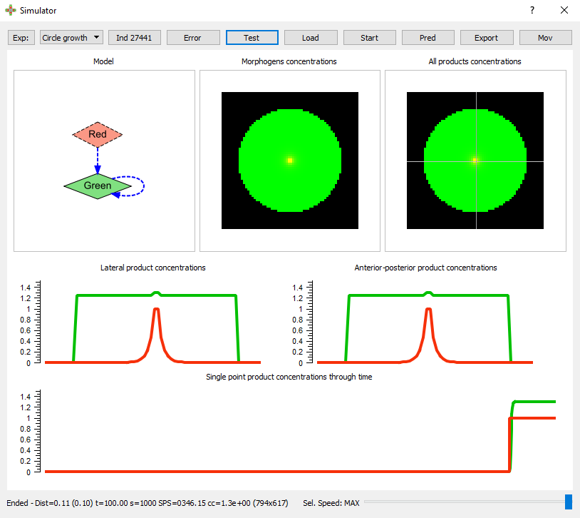

# GRN GPU Performance

Supplementary Data for:

> Inference of Dynamic Spatial GRN Models with Multi-GPU Evolutionary Computation 
> Reza Mousavi, Sri Harsha Konuru, and Daniel Lobo 
[Lobo Lab](https://lobolab.umbc.edu) 
> *Under review*

## Building
Two different solutions are included:
* Evolution: evolutionary algorithm for the inference of GRNs
* Viewer: user interface for visualizing the evolutionary algorithm results

Open each solution and compile them with Microsoft Visual Studio. Make sure the required dependencies are installed in your computer.

## Dependencies
* Microsoft Visual Studio
* NVIDIA CUDA Toolkit
* Eigen
* Qt
* Qwt

## Implementation
The `Src` folder contains all the source code, implemented in C++. It is further structured into the following folders:

### `Common` 
This folder includes helper classes to handle files, save logs, and perform general mathematical methods.

### `DB` 
This folder contains the code for	accesing the database file employed to save the settings and results of the evolutionary algorithm. These include the parameters needed to run the method, the GRN models created during the evolution, and the evolutionary statistics computed during the execution. The viewer can open these files to display the results of an evolutionary run.

### `Experiment` 
This folder includes the code to specify the input initial and target gene expression patterns that are defined in an experiment. Input gene expression patterns are implemented as images, in which each color corresponds to a different gene.

### `GPUSimulator` 
This folder contains the simulator that runs in the GPU. This includes the simulation of GRN models and the computation of their fitness (error with respect the target gene expression pattern). In addition, this folder include classes for the initialization of the GPUs, the copy of input gene expression patterns, and the transfer of GRN models and their numerical fitness between the CPU and GPU memory.

### `Model` 
This folder includes the implementation of GRN models. A model includes a set of genes and their parameters and a set of links specifying the type of regulatory interactions between two genes and their parameters.

### `Search` 
This folder contains the code for loading the parameters of the evolutionary algorithm, handling the model populations in the different islands, generating new models by executing evolutionary operators (crossover and mutation), and selecting the next generation populations. The folder also includes an implementation of the model fitness calculator that runs in the CPU.

### `Simulator` 
This folder includes the simulator that runs in the CPU. This includes the implementation for loading parameters related to the simulation, loading the GRN models defined as classes into a system of PDEs for simulation, and performing the numerical simulation using an Euler finite difference method.

### `UI` 
The UI folder contains the user interface for both the evolution and viewer. The evolution program is run with a command line interface that uses a multi-thread implementation to maximize the performance. The viewer includes a graphical user interface to visualize the results of the evolution and perform simulations of the discovered models.

 
*Screenshot of the user interface for visualizing the simulation of a discovered model.*